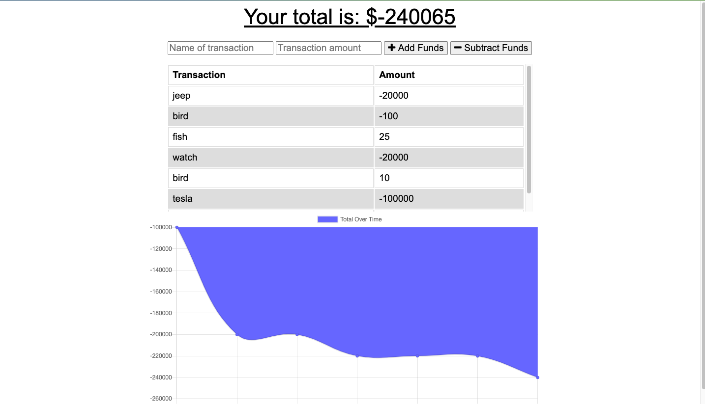

# Budget-Tracker

## Description 

The user will be able to add expenses and deposits to their budget with or without a connection. When entering transactions offline, they should populate the total when brought back online.

## User Story
AS AN avid traveller 
I WANT to be able to track my withdrawals and deposits with or without a data/internet connection 
SO THAT my account balance is accurate when I am traveling

## Business Context

Giving users a fast and easy way to track their money is important, but allowing them to access that information anytime is even more important. Having offline functionality is paramount to our applications success.

## Table of Contents (Optional)

* [Installation](#installation)
* [Usage](#usage)
* [Contributing](#contributing)
* [License](#license)
* [Tests](#tests)

## Installation

To install use the following command: 
<pre><code>npm install</pre></code>

## Usage 

Run: <pre><code>node server.js</pre></code> 

## License

## Contributing

Contributions in the form of issues and pull requests are welcomed and encouraged.

## Tests

To run tests use the following command:

<pre><code>npm run test</pre></code> 

